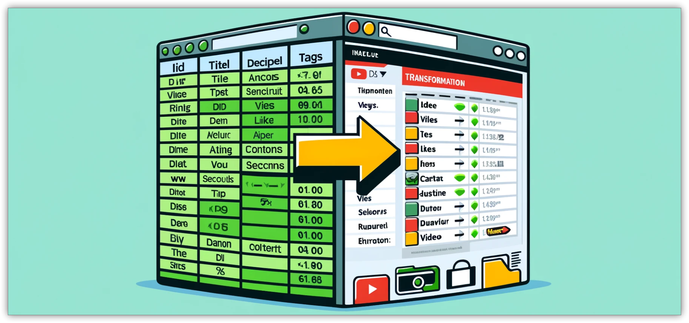

# sheet2web User Documentation
- 
- ## Overview
	- ### Instantly turn a Google Sheet into a web directory that is always up to date
	- sheet2web is an open-source web application designed to effortlessly convert data from a Google Sheet into a fully functional and customizable web directory. This tool bridges the gap between simple spreadsheet management and dynamic web content presentation, making it ideal for users looking to publish and share structured data online without complex backend development.
- ## Table of Contents
	- [Requirements](#requirements)
	- [Setup Instructions](#setup-instructions)
	- [Configuration](#configuration)
	- [Embedding the Directory](#embedding-the-directory)
	- [Usage](#usage)
	- [Annex: Hosting on GitHub Pages](#annex-hosting-on-github-pages)
- ## Features
	- **User-Friendly Configuration**: Simplifies setup with a straightforward configuration file (`config.yaml`).
	- **Embed Capability**: Easy integration into existing websites through iframe embedding.
	- **Responsive Design**: Ensures the web directory looks great on all devices, from desktops to mobile phones.
	- **Data Source Integration**: Seamlessly connects to a published Google Sheets CSV file, ensuring your data is always up-to-date.
	- **Dynamic Content**: Automatically reflects changes made to the Google Sheet, providing a live data presentation.
	- **Customizable Appearance**: Allows extensive HTML and CSS customization to match your website's design and branding.
- ## Requirements
	- Before using sheet2web, ensure you have the following:
	- A Google Sheet with publicly accessible published CSV.
	- Basic knowledge of web hosting and file management.
	- A web server to host the HTML and configuration files.
- ## Setup Instructions
- ### Prepare Your Data
- #### Data in a Google Sheet
	- **Open Your Google Sheet**: Go to Google Drive and open your spreadsheet.
	- **Select the Specific Sheet**: Make sure you are on the sheet you want to publish.
	- **Click on File**: Select "File" from the menu.
	- **Select 'Publish to the Web'**: Choose "Publish to the web".
	- **Configure the Publication**:
		- Select the specific sheet and choose "Comma-separated values (.csv)".
	- **Publish the Sheet**: Confirm the action to make the sheet publicly accessible.
	- **Obtain the CSV Link**: Copy the provided URL.
- #### Data in a CSV File
	- Ensure your data is in a CSV table format. The first row should contain the headers. For example:
	- ```csv
	  ID,TITLE,DESCRIPTION,IMAGE,TAGS,CONTENT
	  1,Sample Item,This is a sample description.,https://example.com/image.jpg,tag1,tag2,<iframe src="https://example.com"></iframe>
	  ```
- ### Upload Files to Your Server
	- **Host on GitHub Pages (Recommended)**
	- **Host on Your Own Server**
		- Upload `sheet2web.html` to your web server.
		- Upload `config.yaml` to the same directory as `sheet2web.html`.
- ### Update Configuration File
	- Edit the `config.yaml` file to configure your application. Below is a sample configuration:
	- ```yaml
	  dataSourceUrl: "https://example.com/data.csv"
	  descriptionLength: 100
	  activeFacets:
	  - TAGS
	  - CATEGORY
	  ```
	  >>>>>>> Stashed changes
- `dataSourceUrl`: URL to your CSV data source.
- `descriptionLength`: Maximum length for item descriptions (optional).
- `activeFacets`: List of facets to enable filtering (optional).
- ## Usage
  Once the application is set up and configured:
- **Loading Data**: The application will automatically load data from the CSV file specified in the `dataSourceUrl`.
- **Filtering Data**: Use the filter buttons to refine the list of displayed items.
- **Viewing Details**: Click on an item to view more details in a modal window.
- ### User Interface
- **Filter Buttons**: Located at the top, used to filter items based on facets.
- **Item Cards**: Display basic information about each item.
- **Modal Window**: Shows detailed information and embedded content when an item is clicked.
- ### Customization
  You can customize the look and feel of the application by editing the HTML and CSS in `sheet2web.html`. For advanced functionality, modify the Vue.js components as needed.
- ## Embedding the Directory
  To embed the directory into another website, use an iframe. For example:
  ```html
  <iframe src="https://yourwebsite.com/sheet2web.html" width="100%" height="600px" style="border:none;"></iframe>
  ```
  Replace `https://yourwebsite.com/sheet2web.html` with the actual URL of your hosted `sheet2web.html`.
- ## Annex: Hosting on GitHub Pages
- ### Step 1: Create a GitHub Repository
  1. Go to [GitHub](https://github.com) and sign in to your account.
  2. Click on the "+" icon in the top right corner and select "New repository".
  3. Name your repository (e.g., `sheet2web-directory`), add a description (optional), and choose "Public".
  4. Click "Create repository".
- ### Step 2: Upload Your Files
  1. Once the repository is created, click on "Add file" and select "Upload files".
  2. Upload `sheet2web.html`, `config.yaml`, and your data CSV file.
  3. Commit the changes by clicking on "Commit changes" at the bottom of the page.
- ### Step 3: Configure GitHub Pages
  1. In your repository, go to "Settings".
  2. Scroll down to the "Pages" section in the left sidebar.
  3. Under "Source", select the branch you want to use (e.g., `main`) and the folder (e.g., `/root` for the main directory).
  4. Click "Save".
  5. GitHub will provide a URL where your site is published (e.g., `https://yourusername.github.io/sheet2web-directory`).
- ### Step 4: Edit Files via GitHub Web Interface
  1. Navigate to the file you want to edit in your repository.
  2. Click on the file name to open it.
  3. Click the pencil icon (edit this file) in the top right corner.
  4. Make your changes and click "Commit changes" at the bottom of the page.
  
  Your `sheet2web` directory is now hosted on GitHub Pages and can be embedded or shared using the provided URL. You can also edit the files directly from GitHub's web interface, making it easy to update your data or configuration without needing to use additional tools.