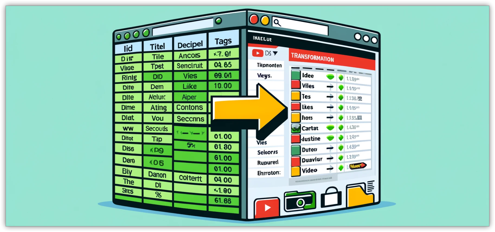

# Instantly turn a Google Sheet into a web directory that is always up to date
- 
- sheet2web is an open-source web application designed to effortlessly convert data from a Google Sheet into a fully functional and customizable web directory. This tool bridges the gap between simple spreadsheet management and dynamic web content presentation, making it ideal for users looking to publish and share structured data online without complex backend development.
  
  <h2>For example, turn <a href="https://docs.google.com/spreadsheets/d/17ZpUIl9HnmiUP_qrxaHqHOyxnA2SV6bf8-7UZ8J9Oyc/edit#gid=431711076" target="_blank">this sheet with data from a youtube channel</a>:</h2>
  
  <iframe src="https://docs.google.com/spreadsheets/d/e/2PACX-1vSYeQU23wzvOVWrqFGqhjXqzhl3Gtdm1uLiVlv2W7eXR-zP0sLEQkm8isiX5PDnqZNYy9bx9xP14vry/pubhtml?gid=0&amp;single=true&amp;widget=true&amp;headers=false" width="500px" height="500px"></iframe>
  
  <h2>into <a href="https://innteresante.com/sheet2web/index.html" target="_blank">this web directory</a>:</h2>
  
  <iframe src="https://innteresante.com/sheet2web/index.html" width="500px" height="500px"></iframe>
- ## Some examples of sheet2web in action:
- This [Google sheet](https://docs.google.com/spreadsheets/d/e/2PACX-1vSYeQU23wzvOVWrqFGqhjXqzhl3Gtdm1uLiVlv2W7eXR-zP0sLEQkm8isiX5PDnqZNYy9bx9xP14vry/pubhtml?gid=0&single=true) is published as a [csv file](https://docs.google.com/spreadsheets/d/e/2PACX-1vSYeQU23wzvOVWrqFGqhjXqzhl3Gtdm1uLiVlv2W7eXR-zP0sLEQkm8isiX5PDnqZNYy9bx9xP14vry/pub?gid=0&single=true&output=csv) generates:
	- [Clean directory](https://innteresante.com/sheet2web/index.html)
	- [Embeded directory](https://innteresante.com/#/pages/videos)
	- [Filtered directory](https://innteresante.com/sheet2web/index.html?tags=inteligenciaartificial)
	- [Embeded filtered directory](https://innteresante.com/#/pages/ia)
- # Get started on [GitHub](https://github.com/lucascervera/sheet2web)